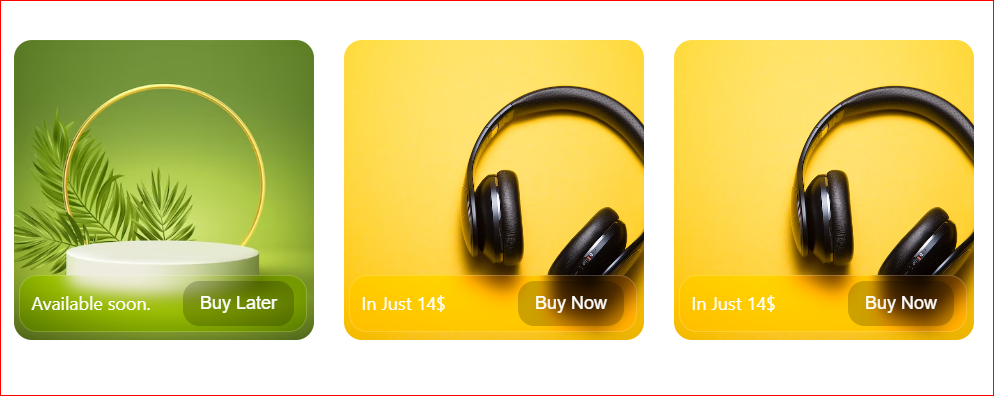

```markdown
# Al-Kafeel UI Library

Al-Kafeel UI Library is a collection of reusable
React components for building user interfaces.
This library provides components such as Avatars
and Buttons that you can easily integrate into
your projects.

## Installation

You can install the Al-Kafeel UI Library using npm or yarn: 

```bash
npm install @tuseefahmed110/al-kafeel-ui
# or
yarn add @tuseefahmed110/al-kafeel-ui
```

## Usage

### Card Components

The `Card` component allows you to display toggel type of image like (product) arious customizations wih button



#### Example:

```jsx
#### Example:
import { Card, Image, FooterCard } from '@tuseefahmed110/al-kafeel-ui';

// Use the Avatar component in your React application
<Card width="200px" height="200px" >
    <Image className="width-100 object-fit-cover radius-1 height-100" src={pic} />
          <FooterCard className="ph-1 white-clr
          box-sizing align-items-center radius-1
          absolute width-100 bootom-1 d-flex width-100 py-6 ph-1 border-1 blur width-cal-8-100 justify-content-space-between d-flex">
            <p className='sm-text lg-white'>Available soon.</p>
            <button className='sm-text ph-2 py-6 bg-black white-clr radius-2  border-none'>Buy Later</button>
          </FooterCard>
        </Card>
```
## Usage

### Toggel Button Components

The `ToggelButton` component allows you to display 
any type of toggel button like follow and unfollow

#### Example:

```jsx
import { ToggelButton } from '@tuseefahmed110/al-kafeel-ui';

 <ToggelButton
        className={`ph-3 py-1 radius-2  
      ${isSubscribe ? 'unfollow-color border-custom' : 'border-1 white follow-color'}`}
        onPress={() => setIsSubscribe(!isSubscribe)}>
        {isSubscribe ? "UnFollow" : "Follow"}</ToggelButton>
```

### Avatar

The `Avatar` component allows you to display user avatars with various customizations.

#### Example:

```jsx
import { Avatar } from '@tuseefahmed110/al-kafeel-ui';

// Use the Avatar component in your React application
<Avatar
  src="/path-to-avatar-image.jpg"
  alt="User Name"
/>
```

#### Props:

- `src` (string): The URL of the avatar image.
- `alt` (string): The alternative text for the avatar image.
- `borderRadius` (string, optional): The border radius of the avatar, e.g., "rounded", "circle", "square", or your custom CSS class.

### Button

The `Button` component is a customizable button for your UI.

#### Example:

```jsx
import { Button } from '@tuseefahmed110/al-kafeel-ui';

// Use the Button component in your React application
<Button
  label="Click me"
  color="blue"
  variant="contained"
  borderRadius="rounded-pill"
/>
```

#### Props:

- `label` (string): The text to display on the button.
- `color` (string, optional): The color of the button, e.g., "blue", "red", "green", or your custom CSS class.
- `variant` (string, optional): The button variant, e.g., "contained", "outlined", "text", or your custom CSS class.
- `width` (string, optional): The width of the button, e.g., "w-48" for a 48px width.
- `borderRadius` (string, optional): The border radius of the button, e.g., "rounded", "circle", "square", or your custom CSS class.

Certainly! You can extend your documentation to include information about the `<AvatarLayout />` component with a `max` prop. Here's how you can document it:

```markdown
## AvatarLayout

The `AvatarLayout` component is designed to create a layout for displaying avatars, with the ability to control the maximum number of visible avatars.

### Usage

```jsx
import { AvatarLayout } from '@tuseefahmed110/al-kafeel-ui';

// Use the AvatarLayout component in your React application
<AvatarLayout max={3}>
  <Avatar src="/avatar1.jpg" alt="User 1" />
  <Avatar src="/avatar2.jpg" alt="User 2" />
  <Avatar src="/avatar3.jpg" alt="User 3" />
  <Avatar src="/avatar4.jpg" alt="User 4" />
</AvatarLayout>
```

### Props

- `max` (number, optional): The maximum number of avatars to display. If the number of avatars provided is greater than `max`, additional avatars will be hidden, and a count of hidden avatars will be displayed.

### Example

In this example, the `max` prop is set to 3, which means only three avatars will be displayed, and the rest will be hidden with a "+X" count:

```jsx
<AvatarLayout max={3}>
  <Avatar src="/avatar1.jpg" alt="User 1" />
  <Avatar src="/avatar2.jpg" alt="User 2" />
  <Avatar src="/avatar3.jpg" alt="User 3" />
  <Avatar src="/avatar4.jpg" alt="User 4" />
</AvatarLayout>
```

In this case, only the first three avatars (User 1, User 2, and User 3) will be visible, and the fourth avatar (User 4) will be hidden with a "+1" count, indicating that there is one more hidden avatar.


## License

This library is open-source and available under the MIT License. You are free to use, modify, and distribute it.

## Issues and Contributions

If you encounter any issues, have suggestions, or want to contribute to this library, please visit our [GitHub repository](https://github.com/tuseefahmed786/Al-Kafeel-UI-Library.git) and create an issue or pull request. We welcome your feedback and contributions.
```
